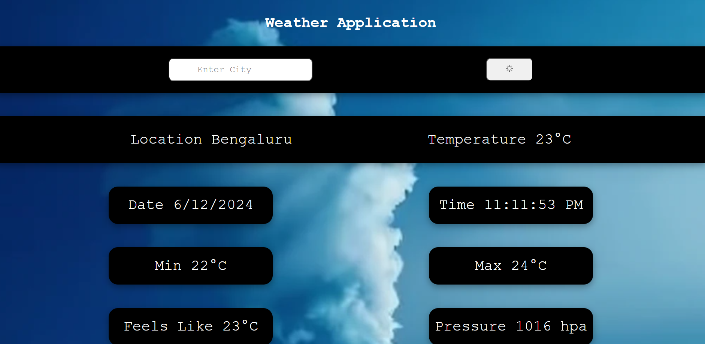
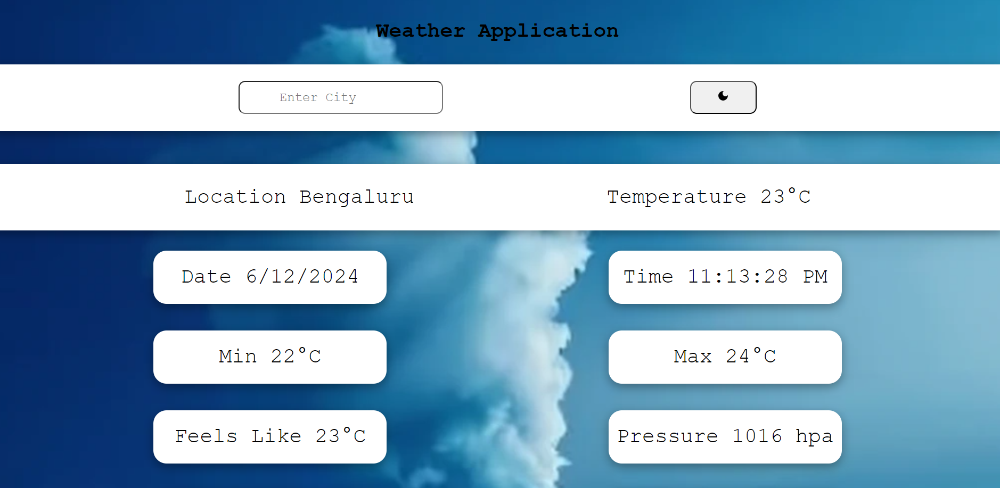
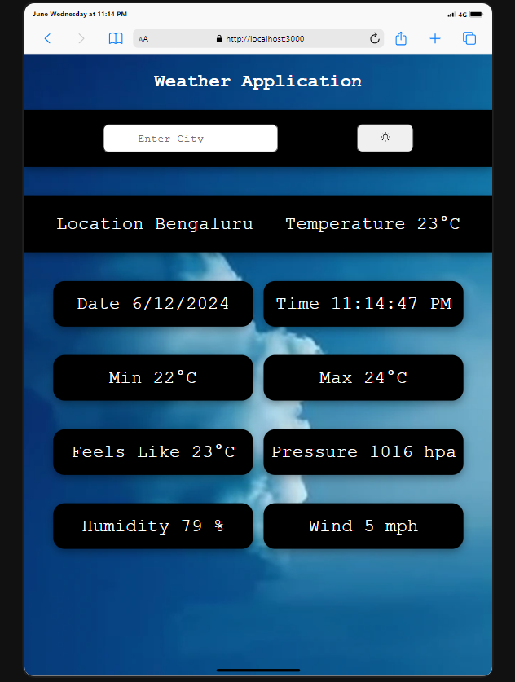
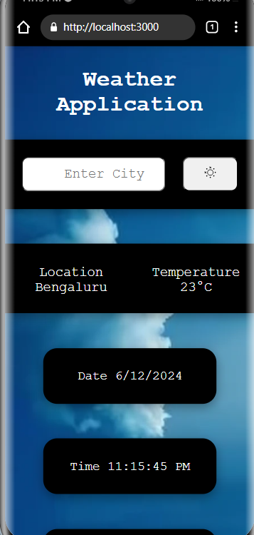

# Kraftshala_weather_application

<h2>To run the application locally - npm run start</h2>

Project link https://kraftshala-weather-application-slta.vercel.app/

<h2>Overview</h2>

This project is a weather application built using HTML, CSS, and React. It provides users with current weather information based on their input, featuring an intuitive and visually appealing user interface. The application includes the ability to toggle between dark mode and light mode.

<h2>Features</h2>

Weather Information: Displays current location, temperature, date, time, humidity, max temp , min temp and wind speed.

Search Functionality: Allows users to enter a city name to fetch weather data.

Dark Mode/Light Mode Toggle: Users can switch between dark and light themes.

Responsive Design: Works well on desktop, tablet, and mobile devices.

<h2>Dark Mood desktop View</h2>

<h2>Light Mood desktop View</h2>

<h2>Tab View</h2>

<h2>Mobile View</h2>

